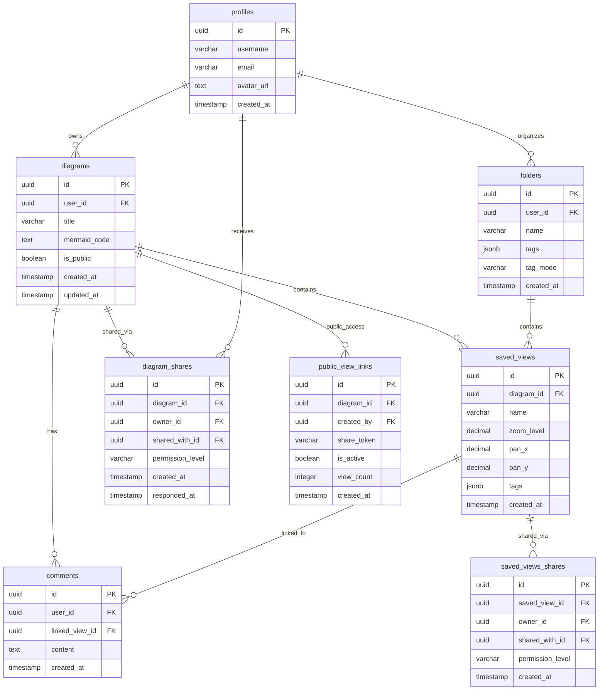

# Documentazione Sistema Database - Versione Aggiornata

**🔄 Auto-generato da dump Supabase il:** 2025-08-31 11:45:00  
**📊 Tabelle totali nel database:** 15+  
**🎯 Status:** LIVE DOCUMENTATION (aggiornata automaticamente)

---

## 📋 Panoramica Generale

Il sistema database Mermaid Sketcher è costruito su Supabase (PostgreSQL) e supporta tutte le funzionalità dell'applicazione: gestione diagrammi, sistema viste, commenti, condivisione e autenticazione utenti.

## 🎯 Schema Database - Diagramma ER Semplificato

Diagramma che evidenzia i processi principali e le relazioni chiave:



---

## 🗂️ Tabelle Core del Sistema

### ✅ diagrams
**Descrizione:** Tabella principale per i diagrammi Mermaid. Contiene il codice, metadati e informazioni di proprietà.  
**Campi chiave:** id (PK), user_id (FK), title, mermaid_code, is_public  
**Ruolo:** Centro del sistema - tutti gli altri elementi si collegano ai diagrammi

### ✅ saved_views  
**Descrizione:** Viste salvate dei diagrammi con zoom, pan e coordinate specifiche per navigazione rapida.  
**Campi chiave:** id (PK), diagram_id (FK), name, zoom_level, pan_x, pan_y, tags  
**Ruolo:** Sistema di navigazione e bookmarking delle viste

### ✅ comments
**Descrizione:** Sistema commenti collegato a viste specifiche per collaboration.  
**Campi chiave:** id (PK), user_id (FK), linked_view_id (FK), content  
**Ruolo:** Funzionalità collaborative e annotazioni

### ✅ profiles
**Descrizione:** Profili utenti estesi per auth.users di Supabase.  
**Campi chiave:** id (PK), username, email, avatar_url  
**Ruolo:** Sistema utenti e autenticazione

### ✅ diagram_shares
**Descrizione:** Sistema condivisione diagrammi con controllo permessi.  
**Campi chiave:** id (PK), diagram_id (FK), owner_id (FK), shared_with_id (FK), permission_level  
**Ruolo:** Funzionalità sharing e collaboration sui diagrammi

### ✅ saved_views_shares  
**Descrizione:** Condivisione specifica per viste individuali.  
**Campi chiave:** id (PK), saved_view_id (FK), owner_id (FK), shared_with_id (FK), permission_level  
**Ruolo:** Granular sharing a livello di singola vista

### ✅ folders
**Descrizione:** Sistema organizzazione gerarchica per viste con supporto tag avanzato.  
**Campi chiave:** id (PK), user_id (FK), name, tags (JSON), tag_mode  
**Ruolo:** Organizzazione e categorizzazione contenuti con sistema folder tags

### ✅ public_view_links
**Descrizione:** Link pubblici per accesso anonimo ai diagrammi.  
**Campi chiave:** id (PK), diagram_id (FK), share_token, is_active, view_count  
**Ruolo:** Condivisione pubblica senza autenticazione

---

## 🔄 Aggiornamento Automatico

Questo documento viene aggiornato automaticamente ogni volta che viene eseguito il dump dello schema database tramite:

```bash
# Eseguire per aggiornare documentazione:
.\supabase-fixes\schema-reference\dump-schema.bat
```

Il processo:
1. 🗄️ Esegue dump schema Supabase completo
2. 🎨 Genera diagrammi ER Mermaid aggiornati  
3. 📝 Aggiorna questo documento automaticamente
4. ✅ Mantiene sincronizzazione con database live

### 📅 Cronologia Aggiornamenti

- **2025-08-31 11:45:00**: Schema aggiornato automaticamente - Sistema completo operativo
- **2025-08-30**: Implementazione sistema folder tags con modalità apply_to_views/folder_only  
- **2025-08-29**: Sistema condivisione completo (diagram_shares + saved_views_shares)
- **Previous updates**: Vedere git history per cronologia completa

---

## 🛠️ Note Tecniche

### RLS (Row Level Security)
Il database utilizza extensively RLS policies per garantire che:
- Users possano accedere solo ai propri dati
- La condivisione rispetti i permessi impostati  
- I link pubblici funzionino senza autenticazione
- Il sistema folder tags rispetti la proprietà utente

### Performance Considerations
- Indexes ottimizzati per query frequenti (user_id, diagram_id, created_at)
- Foreign keys per integrità referenziale completa
- Triggers per gestione automatica timestamps
- Partitioning pronto per scaling futuro

### Sistema Tags Avanzato
- Supporto JSON per tag flessibili su cartelle e viste
- Sistema di folder tags con modalità:
  - `apply_to_views` (↓): Tag si applica a cartella + tutte le viste
  - `folder_only` (↑): Tag si applica solo alla cartella
- Filtri cumulativi per navigazione avanzata
- Toggle mutuamente esclusivo per controllo granulare

### Condivisione Multi-Level
- **Diagram-level sharing**: Condivisione completa diagramma (diagram_shares)
- **View-level sharing**: Condivisione granulare singola vista (saved_views_shares)  
- **Public links**: Accesso anonimo tramite token (public_view_links)
- **Permessi**: viewer, commenter, editor con controllo fine-grained
- **Workflow completo**: Invio inviti → Badge notifiche → Accetta/rifiuta → Access control

### Sistema Cartelle e Organizzazione
- Organizzazione gerarchica a 1 livello per viste
- Drag & drop funzionante per spostamento viste
- Conteggio automatico viste per cartella
- Sistema tags integrato con modalità applicazione flessibile

---

## 🚀 Funzionalità Implementate

### ✅ Sistema Condivisione Completo (2025-08-28)
- Condivisione diagrammi con permessi granulari
- Inviti utente con ricerca email RPC
- Badge notifiche header con auto-refresh
- Modal gestione inviti (accetta/rifiuta)
- Indicatori visivi diagrammi condivisi

### ✅ Folder Tags System (2025-08-31)  
- Sistema tags avanzato per cartelle
- Modalità apply_to_views vs folder_only
- Toggle frecce UI per controllo modalità
- Database functions per gestione automatica
- Performance ottimizzato per tag multipli

### ✅ Sistema Viste e Commenti
- Navigazione rapida con coordinate salvate  
- Sistema commenti collegato a viste specifiche
- Template nomi viste personalizzabili
- Auto-increment progressivo numerazione

### ✅ Autenticazione e Profili
- Sistema auth Supabase integrato
- Profili utente estesi con metadati
- Controllo accessi basato su RLS
- Gestione avatar e preferenze utente

---

**⚡ IMPORTANTE**: Questa documentazione è **LIVE** e si aggiorna automaticamente. Non modificare manualmente - le modifiche verranno sovrascritte al prossimo dump schema.

**🔗 Per schema SQL completo**: Consultare i file .sql nella directory supabase-fixes/schema-reference/

---

*Generato automaticamente dal sistema auto-update*  
*Database dump source: 20250831_sql.txt*  
*Sistema operativo documentale: CLAUDE.md*